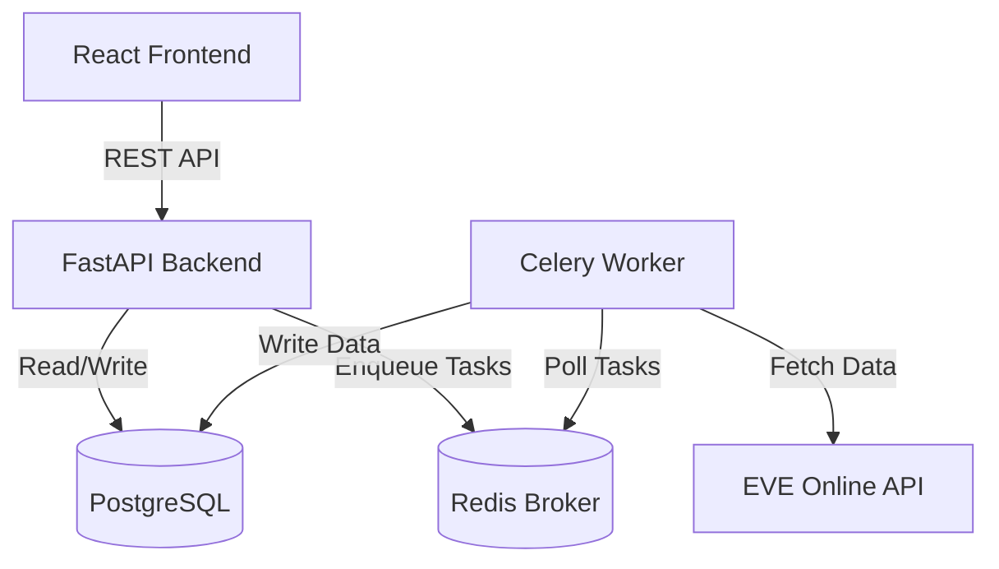

# Lenny - Technical Specification

## 1. Project Overview
**Lenny** is a containerized web application designed for EVE Online players to analyze market data, identify trading opportunities, and track personal finance. It leverages the EVE Swagger Interface (ESI) to fetch game data and presents it via a modern React dashboard.

## 2. System Architecture

The application follows a microservices-like architecture orchestrated via Docker Compose.

### 2.1 High-Level Diagram

### 2.2 Components
| Component | Technology | Purpose |
|-----------|------------|---------|
| **Frontend** | React + Vite | User Interface for dashboards and data visualization. |
| **Backend** | FastAPI (Python 3.11) | REST API, Auth handling, Business logic. |
| **Database** | PostgreSQL | Persistent storage for User data, Market history, and SDE. |
| **Task Queue** | Celery | Asynchronous background jobs (fetching ESI data). |
| **Broker** | Redis | Message broker for Celery and caching layer. |
| **Proxy** | Nginx (Optional) | Reverse proxy for production deployment. |

## 3. Data Design

### 3.1 Database Schema (Preliminary)

#### `users`
Stores user authentication and SSO tokens.
- `id` (PK): UUID
- `character_id`: BigInt (EVE Character ID)
- `character_name`: String
- `access_token`: String (Encrypted)
- `refresh_token`: String (Encrypted)
- `token_expiry`: DateTime

#### `market_orders`
Live market orders fetched from ESI.
- `order_id` (PK): BigInt
- `type_id`: Integer (Item ID)
- `region_id`: Integer
- `price`: Decimal
- `volume_remain`: Integer
- `is_buy_order`: Boolean
- `issued`: DateTime

#### `sde_types` (Static Data)
Item definitions from EVE SDE.
- `type_id` (PK): Integer
- `name`: String
- `group_id`: Integer

### 3.2 Static Data Export (SDE) Strategy
- **Source:** `fuzzwork.co.uk` or official CCP dumps (SQLite/CSV).
- **Ingestion:** A startup script or Celery task will download the latest SDE and populate the PostgreSQL `sde_*` tables to ensure foreign key integrity for `type_id`, `region_id`, etc.

## 4. Component Design

### 4.1 Backend (FastAPI)
- **Auth:** OAuth 2.0 flow using `esipy` or custom implementation.
- **ESI Client:** `EsiPy` configured with a local cache (Redis) to respect `ETag` and `Expires` headers.
    - **Token Refresh:** Backend will refresh EVE SSO tokens automatically when expired. The `esi_client` module contains helpers to call the ESI token refresh endpoint (`/v2/oauth/token`), persist new `access_token`/`refresh_token` values to the `users` table, and retry ESI requests once when receiving `401/403` responses. Ensure `EVE_CLIENT_ID` and `EVE_CLIENT_SECRET` are set in the environment.
- **Endpoints:**
    - `/auth/login`: Redirect to EVE SSO.
    - `/auth/callback`: Handle SSO code exchange.
    - `/api/market/orders`: Query stored orders.
    - `/api/market/history`: Query historical data.

### 4.2 Background Workers (Celery)
- **Queues:**
    - `high_priority`: User-initiated refreshes (e.g., "Update my wallet").
    - `low_priority`: Scheduled market scrapes (e.g., "Scrape Jita 4-4 every 5 minutes").
- **Rate Limiting:** Global lock or token bucket in Redis to prevent hitting ESI error limits.

### 4.3 Frontend (React)
- **State Management:** `TanStack Query` (React Query) for server state (API responses).
- **UI Library:** `Mantine` or `Material UI` for rapid dashboard development.
- **Charts:** `Recharts` for market history graphs.

## 5. Implementation Roadmap

### Phase 1: Infrastructure & Boilerplate
- [x] Set up `docker-compose.yml` with Postgres, Redis, FastAPI, and Node (for dev).
- [x] Configure PDM for Python dependency management.
- [x] Initialize React project with Vite.

### Phase 2: Authentication & Core Data
- [x] Implement EVE SSO (OAuth 2.0).
- [x] Create User model and store tokens securely.
- [x] Implement "Hello World" ESI call (e.g., "Get My Character Info").

### Phase 3: Data Pipeline (The "Engine")
- [x] Set up Celery workers.
- [x] Implement SDE ingestion task.
- [x] Create periodic task to scrape market orders for a specific region (The Forge).

### Phase 4: Market Dashboard (MVP)
- [x] Backend API for querying market orders.
- [x] Frontend table to display orders.
- [x] Basic "Arbitrage" view (Buy vs Sell spread).

### Phase 5: Deployment
- [x] Configure production Docker builds.
- [x] Set up CI/CD pipeline.

### Phase 6: Real Data Integration
- [x] Implement `MarketOrder` database model.
- [x] Update Celery worker to fetch real market data from ESI.
- [x] Implement database storage for fetched orders.
- [x] Update Market API to serve data from database instead of mocks.
